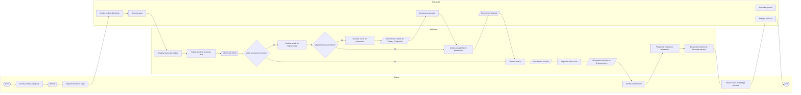

```mermaid
flowchart LR

%% =========================
%% POOL / LANES
%% =========================

subgraph L1["Cliente"]
direction TB

C1([Inicio])
C2[Realiza pedido anticipado]
D1[[Pedido]]
C3[Registra medio de pago]
C4[Recibe confirmación]
C5[Recibe aviso de entrega próxima]
C6([Fin])

end

subgraph L2["Trabajador"]
direction TB

T1[Verifica pedido del cliente]
T2[Controla pago]
T3[Consulta agenda]
D3[/Documento: Agenda/]
T4[Gestiona producción]
T5[Entrega producto]

end

subgraph L3["Autómata"]
direction TB

A1[Registrar datos del pedido]
A2[Validar stock de producto final]

D4[[Informe de Stock]]

A3{¿Hay producto terminado?}

A4[Verificar stock de ingredientes]

A5{¿Ingredientes suficientes?}

A6[Generar orden de producción]

D6[/Documento: Orden de Venta y Producción/]

A7[Actualizar agenda de producción]

A8[Generar factura]

D2[/Documento: Factura/]

A9[Registrar transacción]

D5[/Documento: Archivo de Transacciones/]

A10[Programar notificación automática]

A11[Enviar recordatorio de fecha de entrega]

end

%% =========================
%% FLUJO PRINCIPAL
%% =========================

C1 --> C2
C2 --> D1
D1 --> C3
C3 --> T1

T1 --> T2
T2 --> A1

A1 --> A2
A2 --> D4
D4 --> A3

A3 -- Sí --> A8

A3 -- No --> A4
A4 --> A5

A5 -- Sí --> A6
A6 --> D6
D6 --> T4

T4 --> A7
A7 --> D3
D3 --> A8

A5 -- No --> A7

A8 --> D2
D2 --> A9

A9 --> D5
D5 --> C4

C4 --> A10
A10 --> A11
A11 --> C5

C5 --> T5
T5 --> C6
```